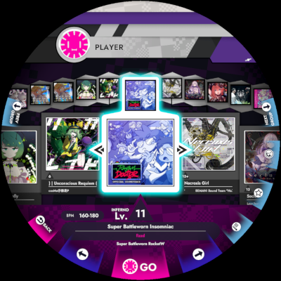
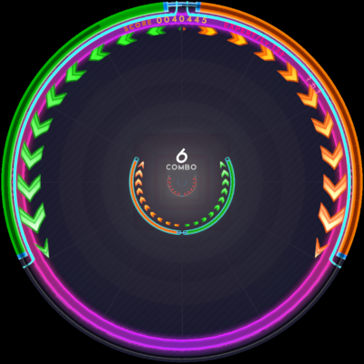

# Saturn 
Saturn is an open-source game for arcade hardware, built from scratch by [Yasu](https://github.com/Yasu3D) and [cg505](https://github.com/cg505).

 

## Features
- Easy installation of new charts.
- Fully-functional gameplay.
- Full support for ring input and ring LEDs.
- Exact settings for scroll speed and offset.
- Pre-tuned settings for long-time ring gamers (Options -> Gameplay Settings -> Offset Mode -> Classic).
- Usable menus for song select and options.

Things that aren't supported yet:
- Keeping track of your scores or PBs.
- Chart favorites.
- Profiles or online support.
- And many other little things...

## Installing Saturn

### Step 1: Prepare your cab
Follow the [The DiVER's Guide at reDIVE](https://redive.world/guide.html) to set up a Windows installation on your cab.

### Step 2: Download Saturn
You can download the latest version of Saturn on [the GitHub releases page](https://github.com/Yasu3D/Saturn/releases). Download the .zip file for win64.

You can either download it from the cab itself, or download it to a USB drive and transfer it onto the cab.

Once you have the .zip file on the cab, completely extract the zip file. It doesn't matter where you extract it to.

### Step 3: Get songs
See [the SongPack format below](#songpacks-format) for more information on how songs should be stored. If you don't know where to get songs, unfortunately we aren't the right people to help you.

Make sure that each song has a meta.mer file, and at least one file name 0.mer, 1.mer, 2.mer, 3.mer, or 4.mer. Make sure all your songs are within the `SaturnGame_Data/Assets/StreamingAssets/SongPacks` folder in the extracted copy of Saturn.

### Step 4: Run Saturn
Just run SaturnGame.exe to start the game. Enjoy!

### Alternatives
- If you already have a unlocked Windows installation or so-called "test drive", you may be able to extract Saturn within this drive instead of setting up a new one.
- Saturn runs well on Linux as well, though this has not been thoroughly tested on a cab. It should work, so if you try it, let us know!

## SongPacks format
Saturn reads songs from the `SaturnGame_Data/Assets/StreamingAssets/SongPacks` folder.

### Folder layout
Each song and its charts must be within its own folder. You can name the song folders whatever you want to help keep them organized.

You can also nest folders to organize things more. In Saturn, you can group songs by the folder they are in, so you may find it helpful to group related songs/charts into the same folder.

### Song folder contents
> _We will move to a new format, that is better suited for Saturn, in the future. As such, instructions below are temporary._

Song folders must use the [wack format](https://github.com/muskit/wack-format), with some additional chart filename restrictions:
- Numbered chart files must only use the names `0.mer` through `4.mer`. Any other chart name will be ignored (e.g. `9p.mer`). The meta file should still be called `meta.mer`.
	- `0.mer` will be the NORMAL difficulty.
	- `1.mer` will be the HARD difficulty
	- `2.mer` will be the EXPERT difficulty.
	- `3.mer` will be the INFERNO difficulty.
	- `4.mer` will be the BEYOND difficulty.
- You don't have to have all of these, as long as there is at least one.
- You cannot "pad" the chart filename with any extra characters.
- It's possible to have 5 charts on the same song if you have all difficulties.

If you are using [MercuryMapper](https://github.com/Yasu3D/MercuryMapper), there is an option to export for Saturn.

### Converting charts to wack format
If you have a chart that you'd like to use in Saturn that isn't in this format, here's the general gist of how you should convert it.

1. Create a new folder for the song, and copy in the chart(s), the audio, and the jacket image.

2. Rename the jacket to jacket.png or jacket.jpg. Rename the chart file(s) to `0.mer`, `1.mer`, `2.mer`, `3.mer`, or `4.mer`, depending on the difficulty.

3. Edit the chart(s) file so that they include all the necessary tags. You can just open the chart in notepad or another text editor. At the start of the file, you should add something like
   ```
   #--- BEGIN WACK TAGS ---
   #LEVEL 13.8
   #AUDIO song-audio-file.mp3
   #CLEAR_THRESHOLD 0.8
   #AUTHOR Chart author name
   #PREVIEW_TIME 92.9
   #PREVIEW_LENGTH 10.0
   #--- END WACK TAGS ---
   ```
   The `BEGIN WACK TAGS` and `END WACK TAGS` lines are optional. Make sure to update all these fields to the correct values.

   `CLEAR_THRESHOLD` is typically 0.45 for a NORMAL, 0.55 for a HARD, and 0.8 for an EXPERT, INFERNO, or BEYOND.

   If these tags are already there, great! You don't need to do anything.

4. Create a file called meta.mer, and in a text editor like notepad, add this:
   ```
   #TITLE 冥
   #RUBI_TITLE めい
   #ARTIST Amuro vs Killer
   #BPM 66-200
   ```
   Again, update these fields to reflect the song you're adding. `RUBI_TITLE` isn't needed for non-Japanese names. It's used to provide Kanji readings for Japanese song titles.

5. If Saturn is running, restart it to reload the song database.

## Replays
> _Note: replay handling will be revamped in the future. The current system is temporary to keep things simple in the mean time._

Any time you play a chart, a replay is saved in your Saturn settings directory:
- on Windows: `AppData\LocalLow\Yasu3D\SaturnGame`
- on Linux: `.config/unity3d/Yasu3D/SaturnGame`

To watch the replay, first make a copy of the replay file name `replay.json.gz` (in the same folder). Then, in Saturn, start the corresponding chart and press F11 as soon as gameplay loads.

There's no check to make sure this replay corresponds to this chart, so if it looks like the replay is randomly flailing, make sure you have loaded the right chart.

Replay files are very useful to the developers to understand what happened if you run into a gameplay issue.

## Quirks

### Gameplay differences
It's very hard to exactly replicate gameplay, though we've done our best. For instance, we believe that the Saturn repo contains the best known model for how swipe detection works. But some things are inevitably different due to fundamental engine differences.

Notably, **in Saturn, you can fakeslide/tapslide 16ths at _exactly_ 150 BPM or faster**, no exceptions. For subtle engine reasons, some legacy charts could be slid at lower BPMs like 147, but this will not work in Saturn.

Snap detection in Saturn is more sensitive, and swipe detection may be more sensitive in some cases, for instance on full circle swipes.

If you find an issue with gameplay that you don't expect, please let us know and send us a [replay file](#replays).

## Development
Saturn is a community-run game and lives on community contributions. If you want to contribute code, here's how you can set up Saturn development locally.

1. Download Unity Hub
   - Official download link: https://unity.com/download
   - If you are using Arch Linux, use the [unityhub AUR package](https://aur.archlinux.org/packages/unityhub). This is what cg505 uses.
2. Using git, clone Saturn (please look elsewhere for a git tutorial if you don't know how to do this).
3. Open Unity Hub and under Projects, click Add and locate your clone of Saturn. You may be prompted to install the correct Unity version, which you should do.
4. Open the Saturn project. If you get a compilation error warning, don't use Safe Mode. Unity can get confused because some additional packages need to be automatically installed before it will compile.
5. Great, now the SaturnGame project should be open. You can build and run the game normally through Unity on your computer, or build and copy it over to a cab to test I/O features.

### Dev tips
- Unity might not automatically load a scene. You can open one of the scenes in the project browser:
	- `Assets/Scenes/_RhythmGame.unity`: main gameplay scene
	- `Assets/Scenes/Menus/_SongSelect.unity`: song select screen
	- `Assets/Scenes/Menus/_Options.unity`: player settings screen
	- and several other less-commonly-used scenes in `Assets/Scenes`
- When testing on your own computer, you obviously don't have a ring. There are dev keyboard shortcuts that you can use to get around instead.
	- Global:
		- F2 to enable the LED view overlay (shows the ring LED values onscreen)
	- In most menus:
		- A/D to go up/down or left/right
		- Space to select (hit GO or OK)
		- ESC to go back
	- In song select:
		- S to change sort
		- Q/E to navigate sort groups
		- up/down to change difficulty
		- O in the chart preview screen to go to options
	- In gameplay:
		- ESC to immediately back out to song select
		- numpad 0 to enable keyboard input
		- numpad numbers except 0 and 5 (that is, 12369874) to make rough ring inputs
		- 1-6, Q-Y, A-H, Z-N to control the 24 segments at the bottom of the ring
		- I/J to double or half the playback speed (very useful for getting to a specific part of the song quickly)
			- M to reset speed
- In the \_RhythmGame scene, you can enable the Debug Chart Player component (under --Misc in the object hierarchy) to quickly test a chart.
	- Set the song folder and difficulty on the component and enable it.
	- Hit Play in Unity, then hit L to load and begin the selected chart.
	- This is also useful for checking replays - hit F11 to load the replay before loading the chart.
    - When the Debug Chart Player is enabled, you can use the up/down arrow keys to change the scroll speed.
